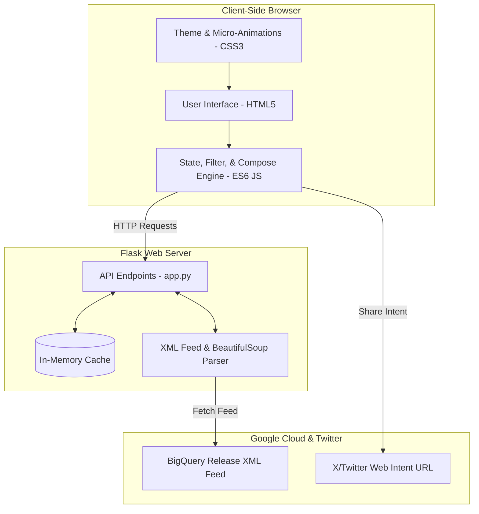
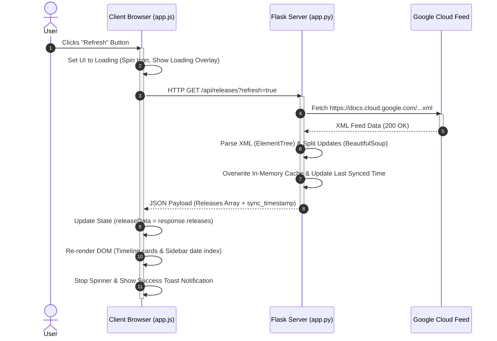
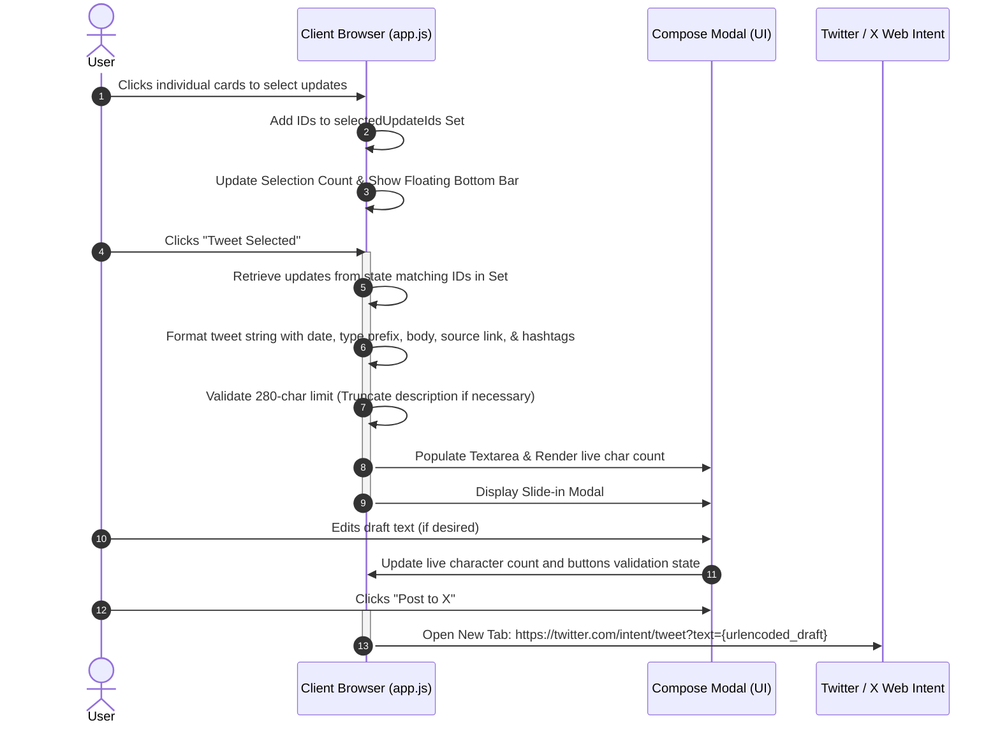

# 🧠 System Architecture & Data Flow

This document outlines the detailed architectural design, structural breakdown, and communication flows of the BigQuery Release Notes Hub.

---

## 🏗️ Architectural Overview

The application utilizes a lightweight client-server architecture. The Flask backend acts as a parsing and caching proxy, while the frontend handles all rendering, search indexing, and interactive composition.

---

## 🗂️ Component Breakdown

### 1. Backend Server (`Python Flask`)
Located in [app.py](file:///C:/Users/Harshit%20Singh/Desktop/Learning/agy2-project/my-second-project/app.py), the backend handles content retrieval, normalization, and delivery optimization:

* **XML Feed Parser**: Downloads the raw RSS/Atom feed from Google Cloud. It utilizes Python's built-in `xml.etree.ElementTree` to parse the Atom wrapper tags.
* **Granular BeautifulSoup Splitter**: The feed contains daily release logs containing multiple items inside `<content type="html">`. The backend walks through this HTML and splits it using `<h3>` tags as element markers. This isolates individual updates (e.g. separates "Feature" from "Issue") so they can be selected individually.
* **In-Memory Cache System**: Stores a global dictionary (`data`, `last_fetched`, `error`). The cache expires after 5 minutes (300 seconds) to prevent redundant network requests and avoid rate limits. It can be bypassed using the `?refresh=true` query parameter.

### 2. Frontend Client (`Vanilla HTML, CSS, JS`)
Located in [templates/index.html](file:///C:/Users/Harshit%20Singh/Desktop/Learning/agy2-project/my-second-project/templates/index.html), [style.css](file:///C:/Users/Harshit%20Singh/Desktop/Learning/agy2-project/my-second-project/static/css/style.css), and [app.js](file:///C:/Users/Harshit%20Singh/Desktop/Learning/agy2-project/my-second-project/static/js/app.js):

* **User Interface Structure**: Employs semantic HTML5 markup featuring a main sidebar control panel (keyword search, badge filters, date links) and a main scrollable timeline stream.
* **Styling (CSS Variables & Easing)**: Designed using high-fidelity dark-mode aesthetics. Implements CSS Grid for responsiveness, glassmorphism filters (`backdrop-filter`), custom variables for dynamic badges (Feature, Issue, Deprecation), card border glow indicators, and rotation animations.
* **Interactive State Engine**: Written in vanilla ES6 JavaScript to coordinate user interaction:
  * **Local Search & Filter**: Dynamically matches entries against active search tokens and categorizations without reloading the page.
  * **Selection Tracker**: Maintains a unique `Set` of active card IDs. When cards are selected, it dynamically controls the visibility and metrics of the bottom action bar.
  * **Tweet Composer Logic**: Gathers selected cards, constructs structured text, auto-appends official links and tags, and applies smart truncation (appending `...` before tags) if the draft exceeds 280 characters.

---

## 🔄 End-to-End Sequence Flows

### Sequence A: Fetching & Refreshing Releases
This sequence describes what happens when a user clicks the **Refresh** button to sync data.

---

### Sequence B: Composing & Sharing a Tweet
This sequence describes how selection, draft generation, and Twitter/X redirects are executed.

